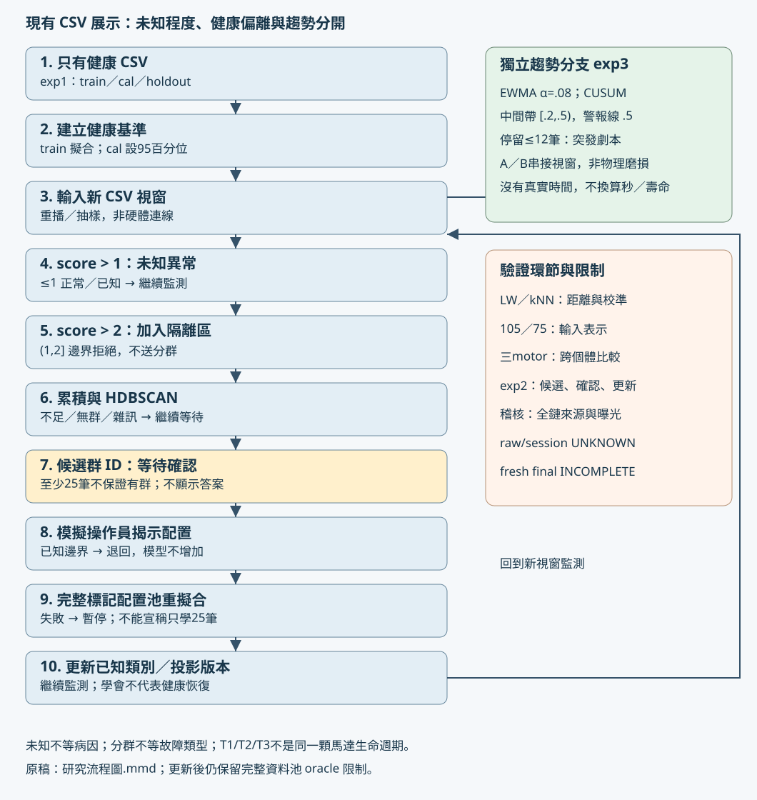

# 研究流程圖

原稿：[Mermaid](exp24_研究流程圖.mmd)。SVG可直接放進報告；圖形代表既有程式，不代表新演算法。來源：core/monitor.py、core/openset.py、experiments/exp2_scale_growth.py、experiments/exp3_trend.py、web/live.py。

從健康配置切出train/cal/holdout；未知配置未參與健康模型擬合。新視窗超過偵測線1稱為未知，超過隔離線2才累積到隔離區。HDBSCAN找的是特徵群，不是物理病因；資料不足、雜訊或無候選都繼續等待。操作員確認可退回已知邊界群，也可揭示模擬新配置。現有confirm使用完整配置池重新切分與擬合，不能說只學了剛到達的25筆。

實作限制：ScaleGrowthSession._try_cluster目前在後端快取truth的majority/purity/is_known，但叢集幾何不使用truth。本輪導覽遮蔽這些欄位；不能宣稱既有後端直到confirm才首次讀truth。自由人工標註與arrival-only替換不在本輪實作。

趨勢是另一條分支，A／B是CSV視窗拼接劇本。警報以筆數呈現，沒有物理時間、磨損真值或壽命。T1/T2/T3是不同馬達。

| 圖中環節 | 主要驗證實驗 | 可支持與限制 |
|---|---|---|
| 輸入表示 | 105／75、C–M | 舊資料探索，正式105不改 |
| 健康基準與拒絕 | exp1、LW消融、Maha／kNN | 同工況與跨馬達需分開 |
| 更換個體 | 固定方法三motor folds | T1 unknown仍0%，不可部署保證 |
| 候選／確認／重擬合 | exp2、arrival-only研究 | 既有展示是完整資料池oracle |
| 趨勢 | exp3 | 劇本辨別，不是物理退化證明 |
| 全流程來源 | provenance／exposure guards | raw/session仍UNKNOWN；fresh INCOMPLETE |

> 主線整合註記：這份研究摘要來自固定研究提交 `b3d68f145cfa187e208e38cae74bf33f68d7c367`。表中歷史數字不是本輪重新執行；連到研究提交的模組／報告未必已合入 main。本輪只整合獨立導覽，main 的 PolarMap 與實驗頁保留。
